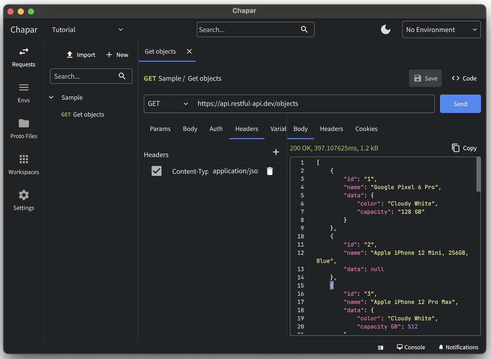


  

  Free, open source
  



  The API Client that simply works



  A fast, secure, and offline API client for your REST and gRPC services


 




  

    Available for macOS, Windows, and Linux
  


   
  
  


