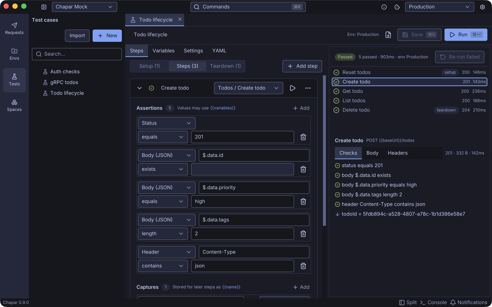
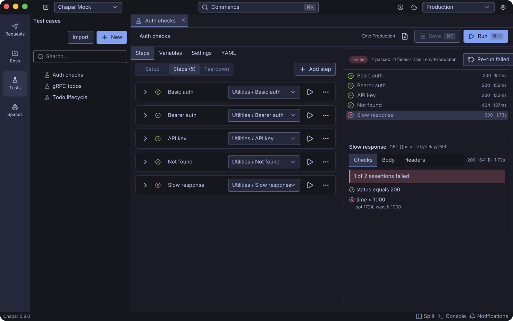
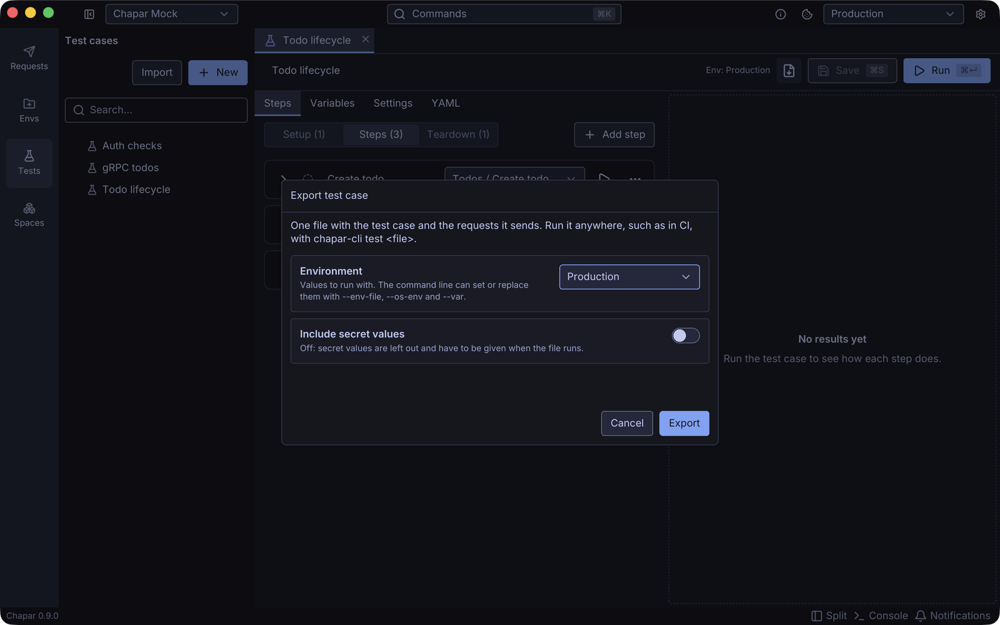

Until now, Chapar helped you send a request and look at the response. With 0.8 it can also tell you whether the response is right. A **test case** sends your saved requests in order, checks each response and passes values from one step to the next. You can run it in the app, and you can run the same file in CI.

<!--more-->


## Why test cases

Most of us already keep a collection of requests for the API we work on, and we check the responses by eye after every change. That works until there are too many requests to check, or until the bug is in step three of a flow that starts with a login.

We didn't want a second place to describe the API, so a test case doesn't redefine your requests. It points at them. Auth, collection headers, pre and post-request actions, Python scripts and cookies all work exactly as when you click **Send**. If you change a request, every test that uses it sees the change.

## What a test case can do

Each step picks a request and adds checks to it:

- **Assertions** on the status, headers, cookies, a JSON path in the body, the raw text, response time and size, and gRPC metadata and trailers. Operators include `eq`, `contains`, `in`, `gt`/`lt`, `matches` (a regular expression), `type` and `length`.
- **Captures** that keep a value for later steps. Take the new todo's id from `$.data.id` and the next request uses it as `{{todoId}}`.
- **Retries** with a delay, for jobs that finish in the background, and a **timeout** per step.
- **Overrides** of a request's variables, headers, query or body, for this one step only.



Cases have **setup** steps that run first (log in, reset data) and **teardown** steps that run last, even after a failure or when you click **Stop**.

A run starts from a copy of your environment and an empty cookie jar of its own. Running a test never changes your environment or the cookies you see in the app, unless you turn on **Save environment changes**.

## Results you can read

Results stream in while the case runs. Click a step to see every check with the value it got and the value it wanted, plus the response body and headers. **Re-run failed** runs only the steps that didn't pass, with setup and teardown around them.



## Plain YAML files

A test case is a `.yaml` file in your workspace's `testcases` folder. You can edit it as a form or switch to the **YAML** tab and edit the text. Since your workspace is already a folder of YAML files, tests can live in git next to the code they test and go through review like everything else.

```yaml
steps:
  - id: create
    request: { ref: Todos/Create todo }
    assert:
      - { target: status, op: eq, value: 201 }
      - { target: body, path: $.data.priority, op: eq, value: high }
    capture:
      - { var: todoId, from: body, path: $.data.id }
```

## `chapar-cli` for CI

The new `chapar-cli` binary runs test cases without the app. It is a single static binary for Linux, macOS and Windows, with no GPU or window system needed:

```bash
curl -fsSL https://github.com/chapar-rest/chapar/releases/latest/download/install-cli.sh | sh
# or
brew install chapar-rest/chapar/chapar-cli
```

```bash
chapar-cli test --workspace api-tests --env Staging --report junit=results.xml
```

You can also **export** a test case into one file that holds the case, the requests it sends and, if you want, an environment. That file runs anywhere with `chapar-cli test todo-lifecycle.yaml`, with no workspace needed.



There's a full walkthrough in [Running API tests in CI with chapar-cli](../api-tests-in-ci/).

## Also in 0.8: import from curl

Paste a curl command, such as one from API docs or a browser's *Copy as cURL*, into **Import › From curl command…** or straight into a request's URL field. Chapar fills in the method, URL, params, headers, body and auth.

## Notes

- Files made with the early preview of test cases can't be read anymore. Chapar tells you when it finds one, and you'll need to create the case again.
- Exported test cases don't include proto files, so gRPC steps in an exported file need a server with reflection.

Get 0.8 from the [releases page](https://github.com/chapar-rest/chapar/releases/tag/v0.8.0), and read the [Testing docs](/docs/testing/) for every option.
