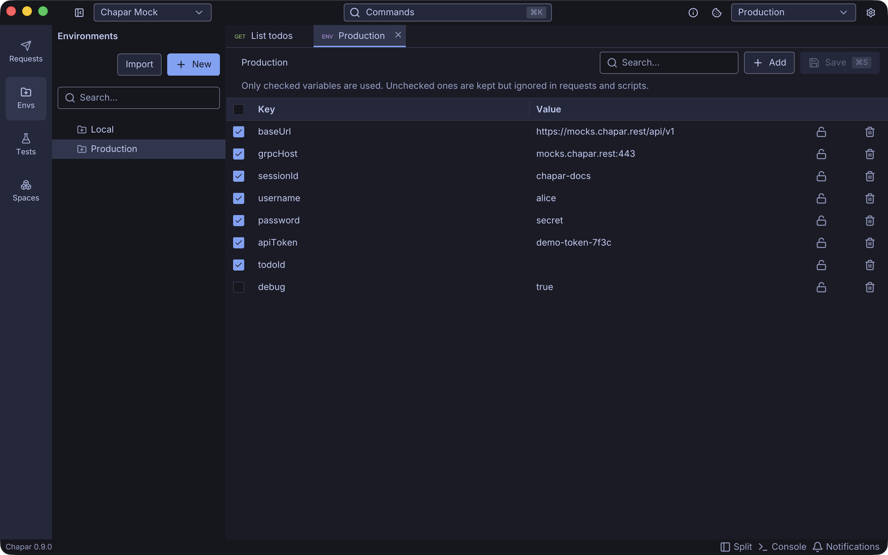
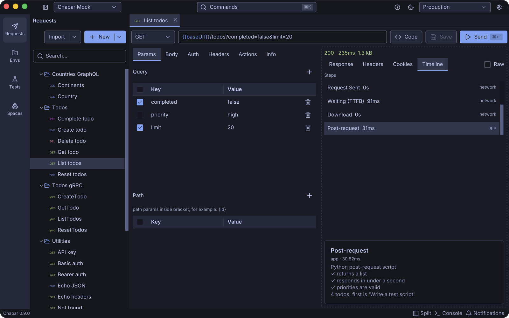

0.8 added a big feature. 0.9 goes the other way: it fixes the places where Chapar didn't do what it looked like it was doing. One of them changes behavior, so please read the first section if you use the checkbox on environment variables.

<!--more-->

## Unchecked variables are really off now

Every environment variable has a checkbox. Until 0.9, unchecking it only changed the hints in the editors. The variable was still replaced in requests and still passed to scripts.

Now an unchecked variable is kept, but ignored everywhere: in URLs, headers, bodies, scripts and test cases. The **Envs** page explains this under the environment's name. When a script or a request action sets a variable, Chapar checks it for you, so values set from code always take effect.


If you had a variable unchecked and relied on it being replaced anyway, check it again after updating.


## Clearer script errors

A pre-request script runs before there's a response, so `response` is empty there. Using it used to fail with `'NoneType' object has no attribute ...`, which didn't help anyone. Now the editor flags `response` in a pre-request script, and running it gives an error that says what's wrong.

This needs the new script runner image, `chapar/python-executor:0.3.1`. Chapar moves your settings off older images (including `latest`) to the version it pins. A custom image, or a newer version, is left alone.

## A better timeline

The detail of a timeline step, such as a script's traceback, now wraps long lines, keeps the traceback's indentation, and can be selected and copied. It sits at the bottom of the pane and scrolls when it's long.

## Editors and UI

- Editor settings (line numbers, wrap, auto-closing brackets and quotes, spaces or tabs) now apply to the editors, and you can preview them live in **Settings**.
- Response editors are read-only.
- Fixed a crash when pressing Enter in a soft-wrapped editor.
- Right-clicking empty space in a tree opens its menu.
- The collection view's tabs and headers match the request view's.
- Spaces typed into a request's name are kept.

## 0.9.1: cookie values in a narrow pane

With the request and response side by side, the response's **Cookies** tab lost its **Value** and **Flags** columns, and the Value header ran into Domain. Tables now keep their flexible columns readable by narrowing the other text columns, and column headers no longer spill into the next one. The fix is in [Yoga](https://github.com/mirzakhany/yoga), the UI toolkit Chapar is built on, so every table in the app gets it.

## New docs

The docs have a new [Testing](/docs/testing/) section that covers test cases in the app, assertions and captures, and `chapar-cli` in CI. The README and the docs also have fresh screenshots of the current UI.

Get 0.9.1 from the [releases page](https://github.com/chapar-rest/chapar/releases/tag/v0.9.1).
