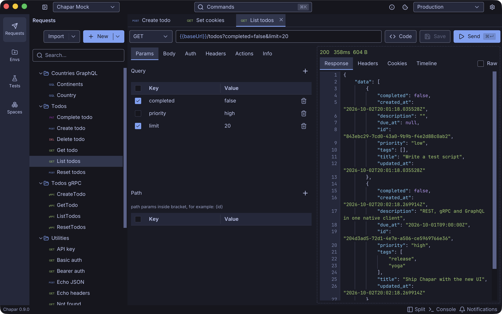

Most desktop API clients today are web apps in a box: Electron, or a system web view. That's a reasonable choice, since you get the whole web platform and a big pool of people who know it. Chapar went the other way. It's a single Go binary that draws its own UI on the GPU with [Yoga](https://github.com/mirzakhany/yoga). This post explains why, what we gained, and what it cost.

<!--more-->

## The numbers

Measured with Chapar 0.9.1 on an Apple M2 running macOS 26, with a fresh space:

| | Chapar 0.9.1 |
|---|---|
| App binary (one architecture) | ~39 MB |
| Download (0.8, arm64) | 19 MB DMG on macOS, 11 MB `tar.xz` on Linux |
| Processes | 1 |
| Memory (physical footprint, idle) | ~122 MB |
| CPU when idle | 0% |
| Launch to window on screen | ~250 ms (warm) |

For scale: the Electron framework alone, the part every Electron app ships before its own code, takes 226 MB in an app installed on the same Mac. A typical Electron app also runs as several processes (main, GPU, renderer, utility), each with its own share of memory.

These numbers aren't a benchmark against any particular app. Many Electron apps are excellent, and a web view isn't what makes an app slow. But an API client is a tool you keep open all day next to an editor, a browser and a few containers, and we'd rather it took as little as possible.

## One language, all the way down

The bigger reason isn't size. It's that Chapar is Go from the UI to the socket.

An API client is mostly networking: HTTP with every kind of body, gRPC with reflection and streaming, TLS and client certificates, cookies, and timings for DNS, connect, TLS and the first byte. Go's standard library and `grpc-go` do all of that well. In an Electron app, that work either runs in Node or crosses a bridge between the UI and a backend process. In Chapar, the request view calls the same Go code that sends the request. The [timeline](/docs/usingchapar/http-requests/) reads `net/http/httptrace` directly.

That also paid off in a way we didn't plan for. When we added [test cases](../chapar-0-8-test-cases/), the runner reused the app's sender, so a test sends a request exactly as the **Send** button does: same auth, same scripts, same cookies. Then `chapar-cli` was the same code built without the UI, a static binary for CI with no GPU, no window system and no browser engine. With an Electron app, a headless CLI usually means a second implementation, or shipping Chromium to a CI runner.

## From Gio to Yoga

Chapar started in 2024 on [Gio](https://gioui.org), an immediate-mode Go UI library. Gio proved the idea: a native Go API client was possible and pleasant to use. As the app grew, we kept running into things that were hard to build on it, such as editors with completions and hover info, tables, a command palette, tab management and custom title bars.

In 0.7 Chapar moved to Yoga, a UI toolkit written in Go for apps like this one:

- It renders with **WebGPU** (wgpu-native on desktop), so text and shapes stay sharp on every display.
- It has a pure-Go **flex and grid layout** engine and the widgets a tool like Chapar needs: code editors with language-server support, trees, tables, splitters, dialogs and menus.
- It runs **headless** with `-tags nogpu`, so UI tests run in CI without X11 or a GPU.
- Its CLI **packages** the app: signed and notarized DMGs on macOS, `tar.xz` on Linux and a zip on Windows, built on stock CI runners.

The [0.7 release notes](https://github.com/chapar-rest/chapar/releases/tag/v0.7.0) list what the move brought: smoother scrolling, variable highlighting and completion everywhere, better tabs, themes checked for contrast and more.

## What it costs

Not using a browser engine means building what a browser gives you for free. Text selection, wrapping, scrolling physics, input methods, accessibility and table layout are all ours to get right. Some bugs only exist because of this. In 0.9.1 we fixed a table whose columns collapsed in a narrow pane, something CSS would have handled.

There's also a smaller pool of contributors who know the toolkit, compared to the millions who know HTML and CSS. We try to make up for that with docs and examples in the Yoga repository, and with the fact that it's all plain Go: if you can read Chapar's networking code, you can read its UI code.

We think it's worth it. Chapar opens fast, stays light when it's been open all week, keeps your data as files on your disk, and ships the same code as an app and as a CI tool.

## Try it

Download Chapar from the [releases page](https://github.com/chapar-rest/chapar/releases) or see [Installation](/docs/gettingstarted/installation/). If you're curious about the toolkit, [Yoga is on GitHub](https://github.com/mirzakhany/yoga), and we're happy to talk about it on [Slack](https://gophers.slack.com/messages/chapar).
