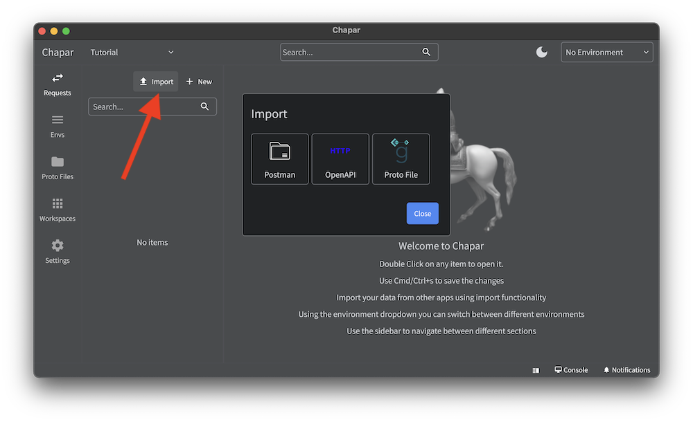
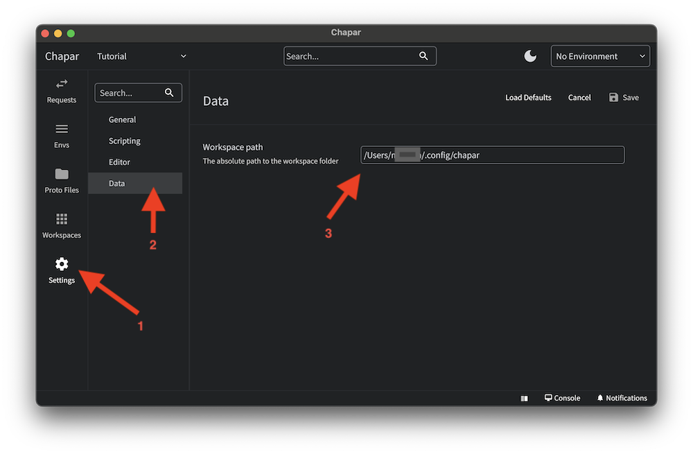

All your data is stored locally on your machine. so you can import data from a file or a directory. 
Where the default location is, is dependent on the operating system. you can change the default location in the settings.



  **macos**: The default location for macOS is `~/.config/.chapar`.
  **windows**: The default location for Windows is `%APPDATA%\chapar`.
  **linux**: The default location for Linux is `~/.config/chapar`.




## Import 

Chapar supports importing data from number of different formats.

- Open API Specification (OAS)
- Protobuf files
- Postman Collection
- Postman Requests
- Postman Environments
- Insomnia (Planned)
- Har (Planned)

To import requests use the import button in the top right corner. and select the file you want to import.



## Change Data Location

You can change the default location for the data in the settings.

Navigate to the settings and select the data location. there you can see where the data is stored. and you can change it to a different location.
After changing the data location, you need to restart the app for the changes to take effect.





 In the current version of Chapar, everything is stored in as files even the environment variables. which means if you put sensitive information in the environment variables, it will be stored in the file system.
 This will be improved in the future. but for now, you need to be careful sharing your data with others.



## Tip: Use a version control system

It's a good idea to use a version control system to keep track of your changes. you can use git to do this.

```bash
git init
git add .
git commit -m "Initial commit"
```

You can then push your changes to a remote repository. and share it with your team.