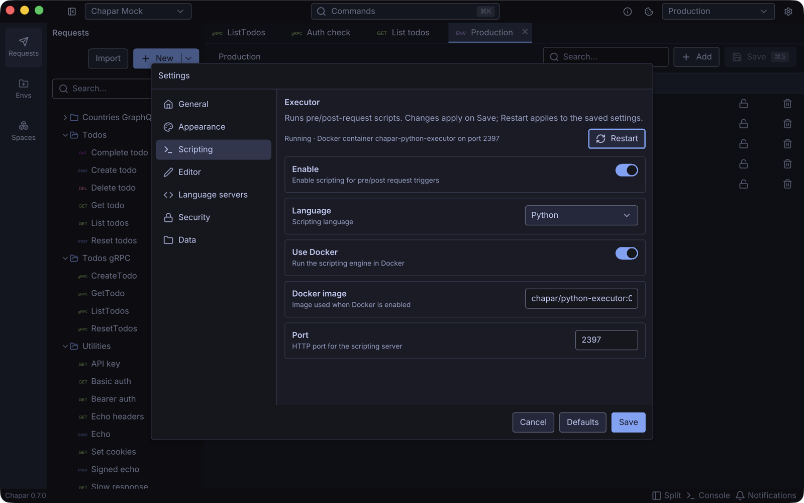
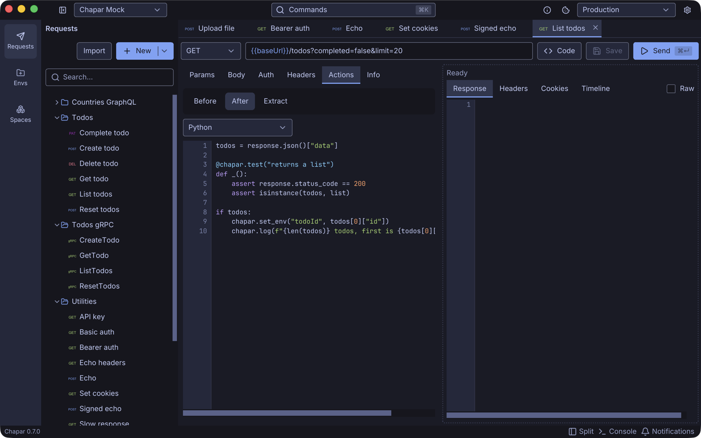
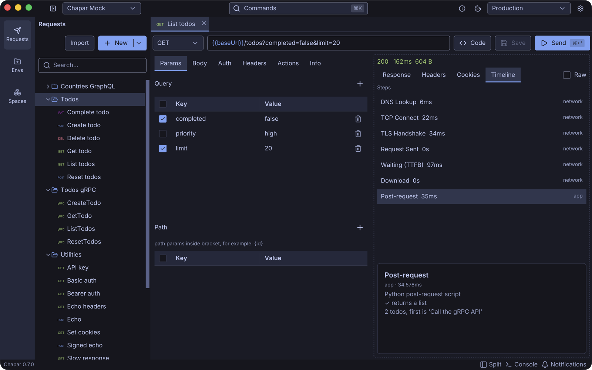
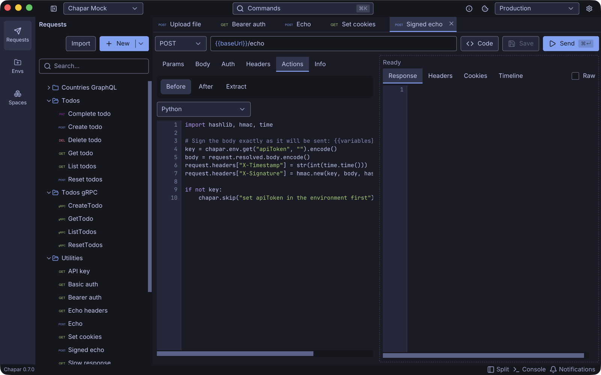

Chapar runs **Python** scripts before a request is sent and after its response arrives. Scripts work for HTTP, gRPC and GraphQL requests. Use them to:

- compute values the request needs: signatures, timestamps, hashes, tokens,
- change the request before it is sent: headers, body, URL, query params, gRPC metadata,
- skip a request when a condition isn't met,
- save values from the response into the environment, with any logic you need,
- test the response and see the results in the timeline.







## How scripts run

Scripts run in the **Chapar Python executor**, a small server that Chapar starts in a Docker container on your machine. For every script run, Chapar sends the script, the request, the response and the active environment to the executor, and applies what the script changed.

```text
Send
 ├─ Before: pre-request script    may change the request, set env values or skip
 ├─ the request is sent
 ├─ After: post-request script    may test the response, set env values and log
 └─ Timeline                      shows the output and test results
```

- Each script runs in a fresh process with Python 3.11, so scripts share no state with each other.
- A script may run for **10 seconds**; after that it is stopped and the step fails.
- Changes a pre-request script makes to the request apply to **that send only**. The saved request never changes.
- Environment values a script sets are written to the active environment and saved.
- Output (`print` or `chapar.log`) and test results appear in the response **Timeline**.
- The container is locked down: it listens on `127.0.0.1` only, requires a per-container token, has a read-only file system (only `/tmp` is writable), runs as a non-root user and is limited to 512 MB of memory and one CPU.

## Setup

Scripting needs [Docker](https://docs.docker.com/get-docker/) (Docker Desktop, OrbStack, Colima or any Docker engine) running on your machine.

1. Open **Settings** (**⌘,**) › **Scripting**.
2. Turn on **Enable**.
3. Keep **Language** on **Python** and **Use Docker** on.
4. Click **Save**.



Chapar pulls the `chapar/python-executor` image the first time, starts the `chapar-python-executor` container, and shows the executor's status at the top of the page, for example *Running · Docker container chapar-python-executor on port 2397*. Chapar starts a fresh container each time it launches and removes it when it quits.

| Setting | Default | What it does |
|---------|---------|--------------|
| **Enable** | Off | Run pre and post-request scripts. |
| **Language** | Python | The only language for now. |
| **Use Docker** | On | Let Chapar run the executor in Docker. |
| **Docker image** | `chapar/python-executor:0.3.0` | The executor image. Each Chapar release pins the version it speaks. |
| **Port** | 2397 | The local port the executor listens on. Change it if the port is taken. |

Use **Restart** to restart the executor with the saved settings, for example after starting Docker.


A request that has a script **fails** when scripting is disabled, with the error *scripting is disabled; turn it on in Settings › Scripting*. Chapar never skips a script silently.


### Without Docker

If you can't use Docker, run the executor yourself and turn **Use Docker** off. Chapar then connects to the executor on `localhost` at the configured port:

```bash
git clone https://github.com/chapar-rest/python-executor.git
cd python-executor
pip install -r requirements.txt
python main.py        # serves on 127.0.0.1:2397
```

The executor runs any code it is sent, so keep it bound to `127.0.0.1`.

## Write your first script

1. Open a request and go to **Actions**.
2. Choose **Before** for a pre-request script, or **After** for a post-request script.
3. Pick **Python** in the selector and write the script.
4. Send the request, then open **Timeline** in the response pane and click the **Pre-request** or **Post-request** step to see the output and test results.

A post-request script that tests the response and saves an id for the next request:

```python
todos = response.json()["data"]

@chapar.test("returns a list")
def _():
    assert response.status_code == 200
    assert isinstance(todos, list)

if todos:
    chapar.env.set("todoId", todos[0]["id"])
    chapar.log(f"{len(todos)} todos, first is {todos[0]['title']!r}")
```



The results, in the **Post-request** step of the timeline:



A pre-request script that signs the body and adds the signature as a header:

```python
import hashlib, hmac, time

key = chapar.env.get("apiToken", "").encode()
if not key:
    chapar.skip("set apiToken in the environment first")

body = request.resolved.body.encode()      # the body with {{variables}} filled in
request.headers["X-Timestamp"] = str(int(time.time()))
request.headers["X-Signature"] = hmac.new(key, body, hashlib.sha256).hexdigest()
```



## Editor support

The script editor has Python highlighting, and, when the Python language server ([pyright](https://github.com/microsoft/pyright)) is installed, completion, hover documentation and error checking that know the `chapar`, `request` and `response` objects. If pyright is missing, Chapar offers to install it; see [Settings › Language servers](../usingchapar/settings#language-servers). `{{variables}}` are highlighted and completed in scripts too.

## When a script fails

If a script raises an exception, the step fails and the timeline shows the error with its line number, for example `line 4: KeyError: 'data'`.

- A failing **pre-request** script stops the request: it is not sent.
- A failing **post-request** script doesn't hide the response: the response is shown, with the error in a line above the response tabs.
- A failing **test** doesn't stop the script. The step reports how many tests failed.

## Next

- [API Reference](api-reference): everything `request`, `response` and `chapar` offer.
- [Examples](examples): logins and tokens, signatures, tests, gRPC and GraphQL scripts.
