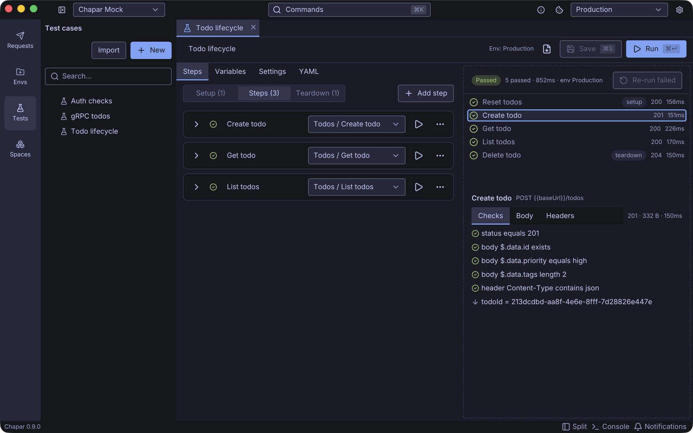

A **test case** sends your saved requests in order, checks each response, and passes values from one step to the next. Build and run test cases in the app, then run the same files in CI with `chapar-cli`.

A test case can:

- check the status, headers, cookies, JSON body, raw text, response time and size of every response, and gRPC metadata and trailers,
- capture a value from one response, such as a new todo's id, and use it in the next request as `{{todoId}}`,
- run **setup** steps first (log in, reset data) and **teardown** steps last, even after a failure,
- retry a step until its checks pass, with a timeout of its own,
- override a request's variables, headers, query or body for one step only.

Steps reuse your requests as they are: auth, collection headers, pre and post-request actions, scripts and cookies all work as when you click **Send**. A run never changes your environment or cookie jar unless you ask it to.







## Try it on the mock server

Every example in this section runs against the free [mock server](../mockserver). Create the `baseUrl` and `sessionId` environment described there, and a few requests in a **Todos** collection:

| Request | Method and URL |
|---------|----------------|
| Reset todos | `POST {{baseUrl}}/todos/reset` |
| Create todo | `POST {{baseUrl}}/todos` with a JSON body such as `{"title": "Ship it", "priority": "high", "tags": ["release", "yoga"]}` |
| Get todo | `GET {{baseUrl}}/todos/{{todoId}}` |
| List todos | `GET {{baseUrl}}/todos` |
| Delete todo | `DELETE {{baseUrl}}/todos/{{todoId}}` |

Give the collection the header `X-Session-Id: {{sessionId}}`, then follow [Test Cases](test-cases) to build the *Todo lifecycle* case shown above.
