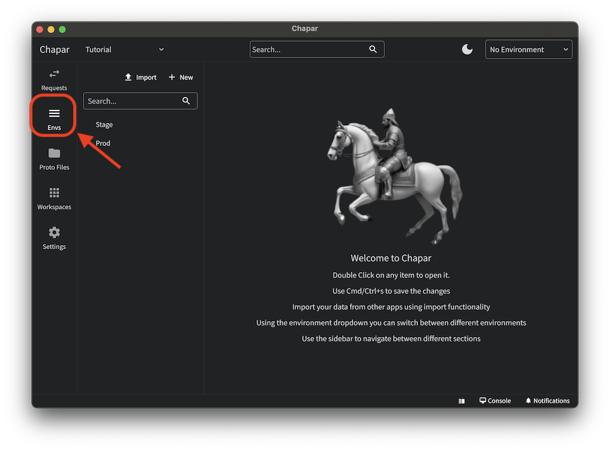
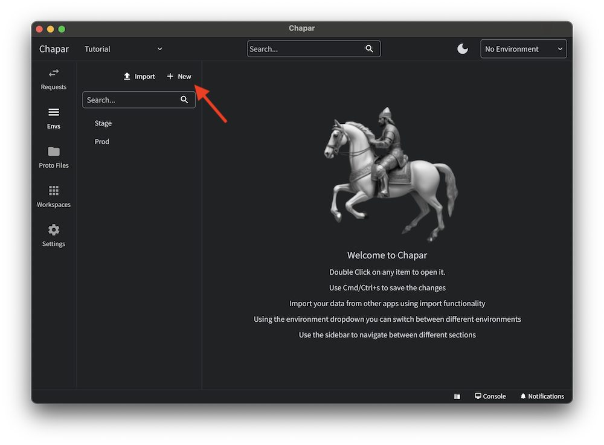
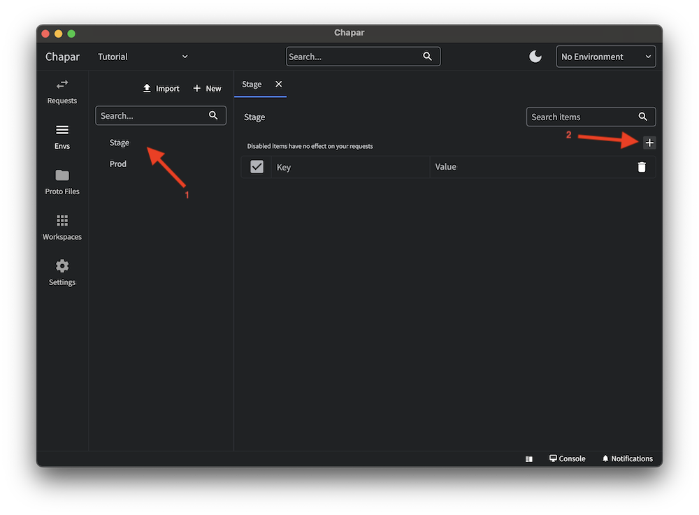
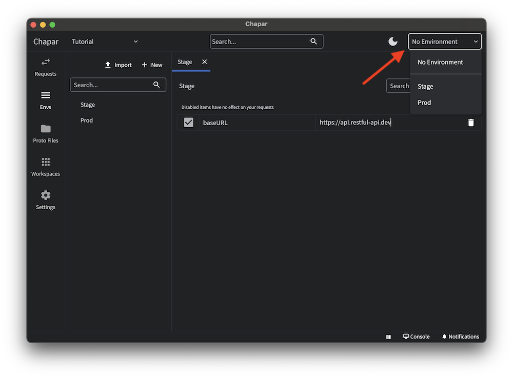
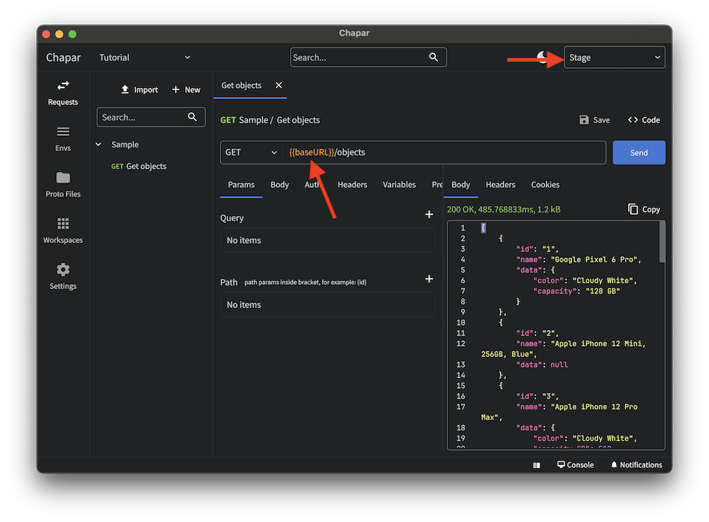

Use environments to manage your API keys, base URLs, and other API-specific settings.
To manage environments, you can click on the environments button on the left navigation bar.

### Create a new environment
Click on the new button to create a new environment.

A new environment will be created with `New Environment` as the name. you can click on the name to edit the name of the environment and press enter to save the changes.

### Edit an environment

You can edit an environment by clicking on the environment in the left sidebar. environment will be opened as a tab in the main window. you can close the tab by clicking the close button on the tab.

Using the plus button (2) you can add a new variable to the environment. variables are used to store the API keys, base URLs, and other API-specific settings.
You can delete a variable by clicking on the delete button on each row.

### Switch between environments
You can switch between environments by choosing the environment from the environments dropdown menu in the top right corner.

### Using variables in requests
After selecting the environment, anywere in your request you can use its variables by using the `{{ variable_name }}` syntax.

