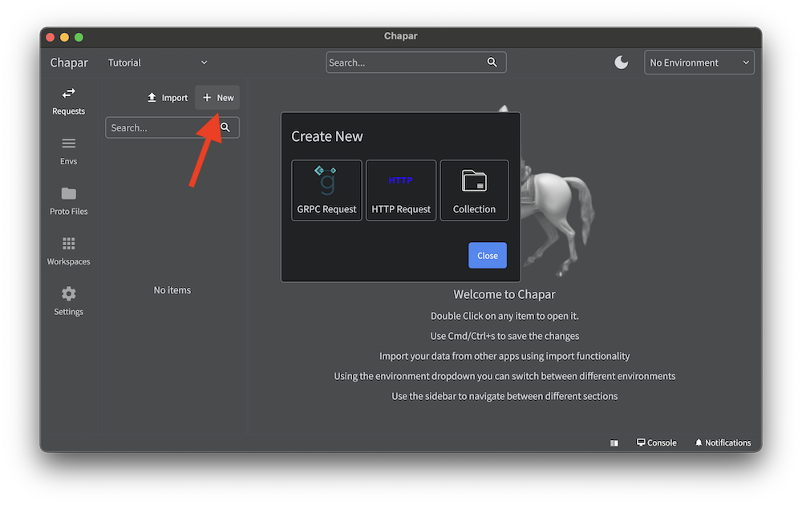
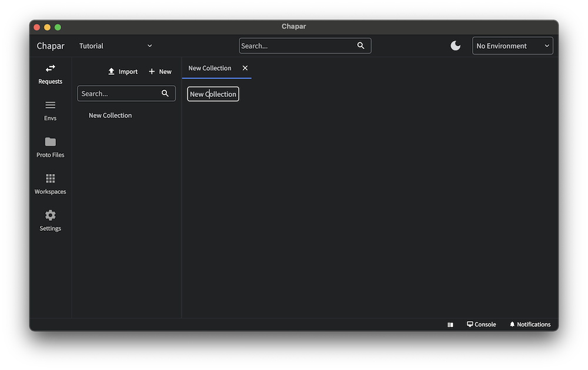
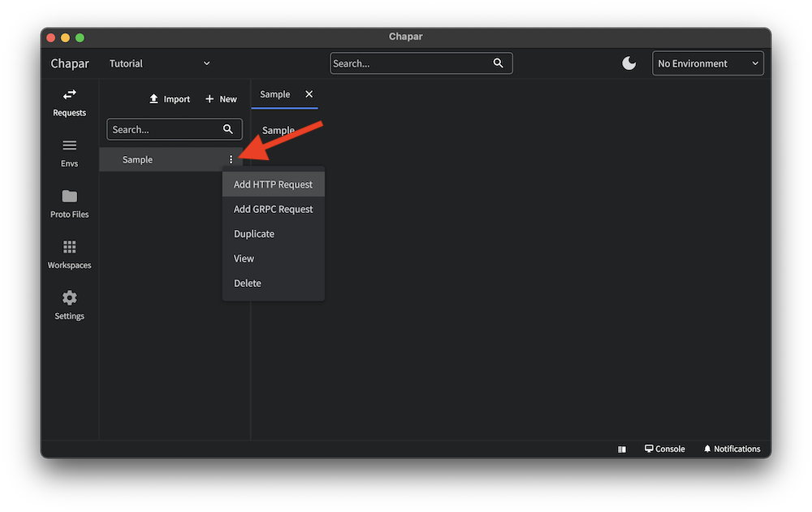
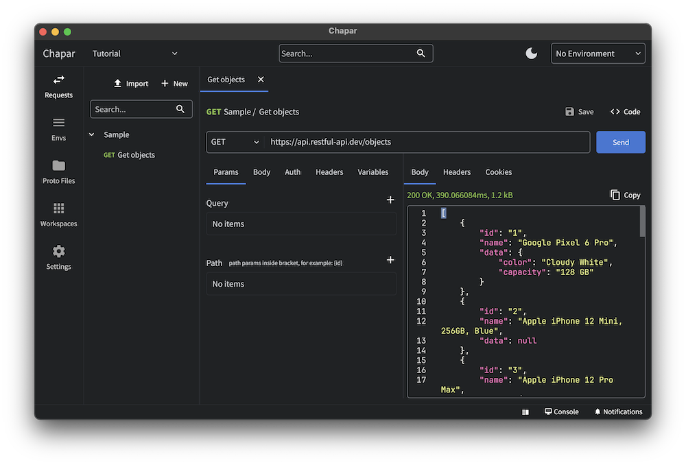

## Create a new request or collection

You can create a new request or collection by clicking the new button in the top right corner. and selecting the type of request or collection you want to create.

A new collection will be created with `New Collection` as the name. and a new request will be created with `New Request` as the name.
you can click on the name to edit the name of the request or collection and press enter to save the changes.

To add a request to a collection, you can click on the three dots on the collection and select the request you want to add.

From the same menu you can also delete the request or collection.

## Open a request

You can open a request by clicking on the request in the left sidebar.request will be opened as a tab in the main window. you can close the tab by clicking the close button on the tab.

