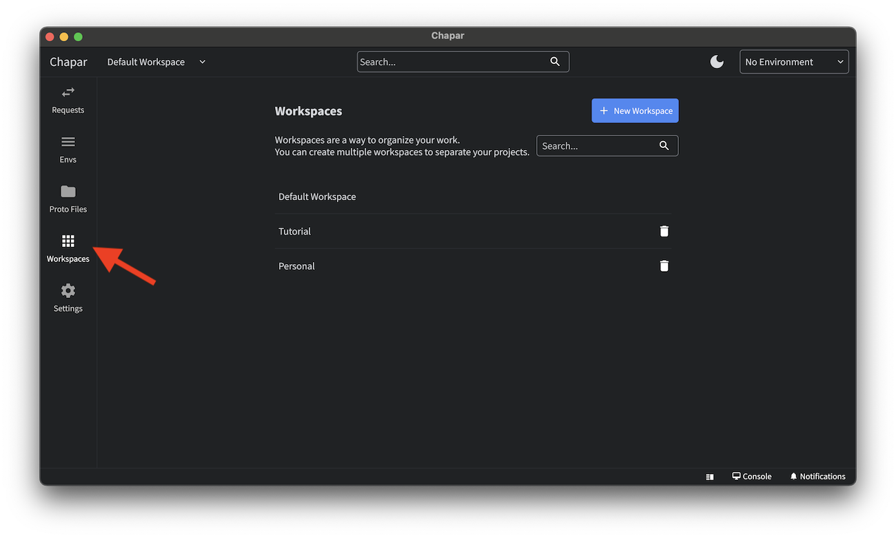
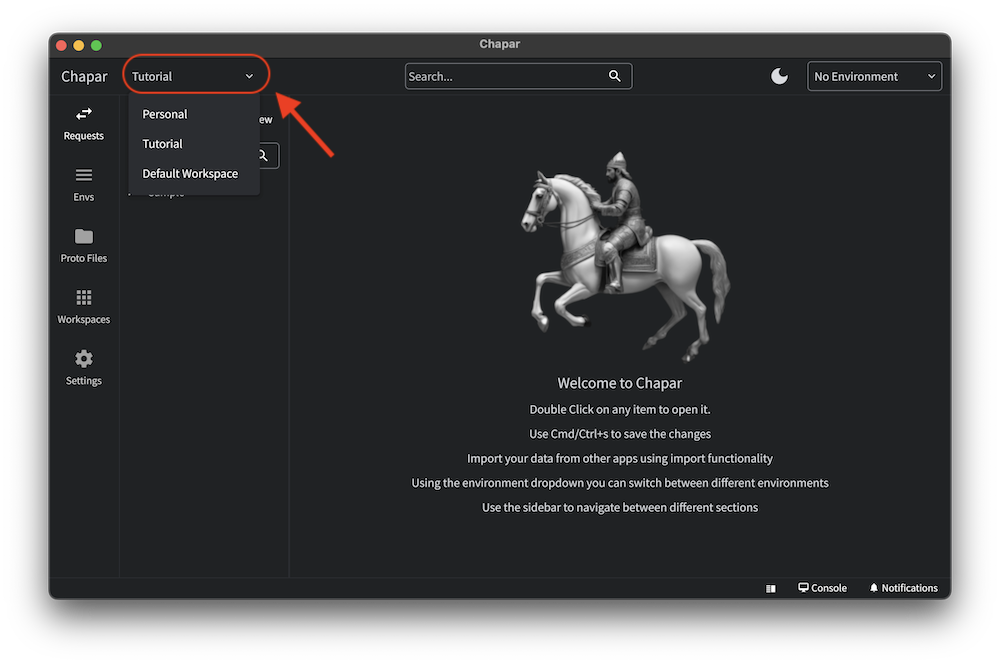

Workspaces are a way to organize your requests and collections.
To manage workspaces, you can click on the workspaces button on the left navigation bar.

### Create a new workspace
You can create a new workspace by clicking the new button in the top right corner.

### Switch between workspaces
You can switch between workspaces by choosing the workspace from the workspaces dropdown menu in the top left.


  When you switch between workspaces, make sure you save and close all the requests and collections that you are working on.
  otherwise you will might lose your work.

